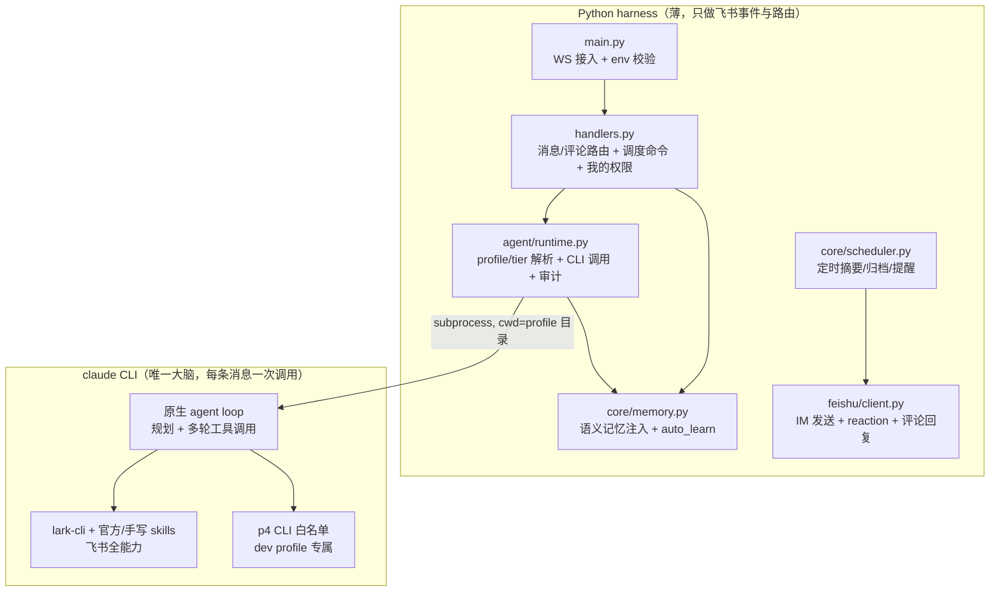
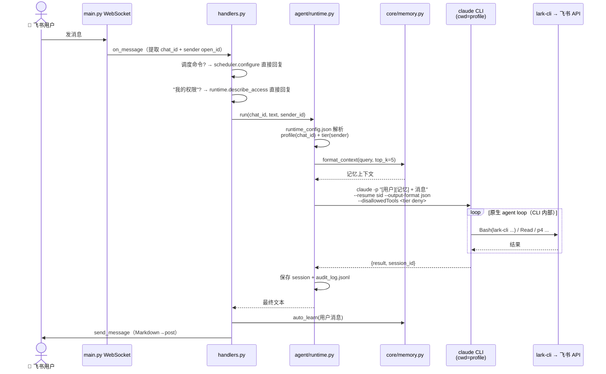
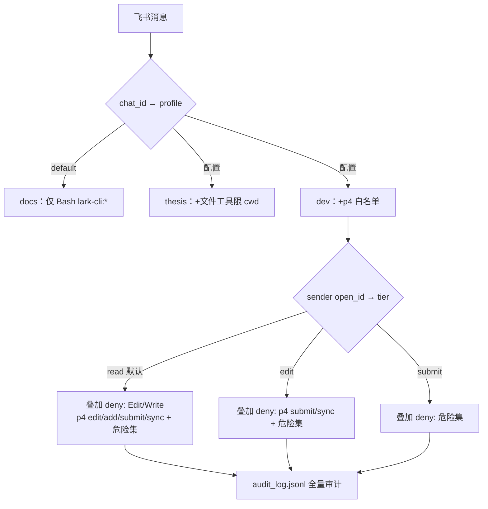

# 飞书团队 Agent — 架构文档 v2

> v2 重构：自研 `[TOOL]`/`[PLAN]` 文本协议与关键词预取全部废弃，Claude Code CLI 成为唯一 agent runtime（原生 agent loop + 原生工具调用 + lark-cli skill）。按人三层权限。目标部署在 P4V 代码仓库所在的云服务器。

## 项目结构

```
assistant/
├── main.py                 # 入口：WebSocket 连接 + 事件注册 + env 校验
├── config.py               # 配置（相对路径优先，env 覆盖，零硬编码绝对路径）
├── handlers.py             # 事件处理器（消息 + 文档评论 → runtime）
├── agent/
│   └── runtime.py          # 核心：CLI 单次调用 + profile/tier 解析 + 审计
├── feishu/
│   └── client.py           # IM 发送 / reaction / 评论回复 / scheduler 专用函数
├── core/
│   ├── memory.py           # 跨会话语义记忆（召回注入 + auto_learn）
│   ├── vector_store.py     # Bigram + TF + Cosine 轻量向量引擎
│   └── scheduler.py        # 定时摘要 + 会议归档 + 任务提醒 + 聊天配置命令
├── profiles/               # agent 人格与权限（按群切换）
│   ├── docs/               #   默认：仅 Bash(lark-cli:*)，文件系统失明
│   ├── thesis/             #   本地毕设：文件工具限 cwd + lark-cli
│   └── dev/                #   模板：部署时拷入 P4 工作区（p4 白名单 + p4v skill）
├── deploy/                 # systemd unit / env.example / 部署指南
├── data/                   # 运行数据（首次运行自动创建）
└── _legacy/                # v1 废弃文件存档（可整个删除）
```

## 分层架构



## 消息处理链路



关键点：
- **每条消息只发一次新内容**，`--resume` 续会话（v1 的 O(n²) 重复发送 bug 消除）。
- 同一 chat 的调用串行（per-chat 锁），不同 chat 并行。
- **不再使用 bypassPermissions**：未 allow 的工具在非交互模式下自动拒绝。
- **进度实时反馈**：CLI 以 stream-json 输出，runtime 解析工具调用事件 → handlers 发进度消息并节流（3s）原地编辑（`⏳ 处理中… 🔧 最近 5 条工具调用`），收尾改为「✅ 完成：工具调用 N 次，耗时 Xs」。

## 权限模型（四道防线）



危险集（所有 tier 永久禁止）：`p4 revert/delete/undo/resolve`。

| 防线 | 机制 | 位置 |
|---|---|---|
| 1 工具层 | settings.json allow + 逐次调用 `--disallowedTools`（deny 优先） | profiles/*/.claude/settings.json + runtime.py |
| 2 行为层 | CLAUDE.md 写明 tier 语义与超限拒绝话术 | profiles/*/CLAUDE.md |
| 3 服务端 | P4 protections：bot 无 super，主干只读、dev 分支可写 | P4 服务器 |
| 4 审计 | 调用全量落 JSONL + changelist 描述归因 `[飞书 ou_xxxxxxxx]` | data/audit_log.jsonl |

人员/群配置：`data/runtime_config.json`（改即时生效），获取 open_id/chat_id 看 audit_log。

## Profile 三件套

每个 profile 一个目录，cwd 机制自动加载（Claude Code 原生约定）：

| 文件 | 作用 |
|---|---|
| `CLAUDE.md` | system prompt：人设 + 行为规则 + lark-cli/p4 速查表 |
| `.claude/settings.json` | 权限白/黑名单（该 profile 的天花板） |
| `.claude/skills/` | 技能（dev 内置 p4v-workflow；官方 lark-cli skills 从飞书 well-known 入口全局同步） |

## 文档评论流

评论事件 → 关键词门（@助手/修改/润色…）→ `runtime.run(profile=docs)`，prompt 携带 doc_token 与用户诉求 → agent 用 lark-cli 自读文档并自行完成追加/替换 → 最终文本经 `reply_to_comment` 回贴评论线程。

## 调度器（L6，保留）

`threading.Timer` 驱动：每日摘要（默认 09:00，日程+任务+记忆动态）、会议自动归档（每 60min）、任务到期提醒（每 3h）。
聊天命令：「推送到这里」「查看配置」「开启/关闭每日推送」「推送时间 hh:mm」「开启/关闭会议归档」「开启/关闭任务提醒」——配置变更即时重启定时任务生效。

**定时 agent 任务（agent_jobs）**：通用"每周定时跑一段 agent prompt"机制，典型用法是每周五自动生成 P4 更新日志并归档飞书。在 `scheduler_config.json` 的 `agent_jobs` 数组中配置（name/profile/chat_id/day_of_week/hour/minute/prompt，示例见 scheduler.py 顶部注释），执行时经 `runtime.run(profile=...)` 推理并把最终文本推送到目标群。

## 已知限制与评估

| 事项 | 结论 |
|---|---|
| per-user OAuth（"查我自己的任务/日程"） | lark-cli 单 profile 单身份，不支持 per-call token 注入。要实现需绕过 lark-cli 直调 OpenAPI（bot 私聊下发授权链接，user_access_token 存 data/user_tokens.json）。工作量集中在新封装层，runtime 无感知；收益限于 calendar/task/vc 三类查询，**暂缓，待真实需求** |
| 个人级 P4 归因 | bot 单 P4 账号，服务端不区分操作者；归因靠 changelist 描述 `[飞书 ou_xxxxxxxx]` + audit_log。真·按人 ticket 暂缓 |
| lark-cli 官方 skills | 使用 `npx skills add https://open.feishu.cn -g -y` 同步，无需 GitHub；后续升级优先运行 `lark-cli update` |
| 多轮中的中间文本 | stream-json 只回报工具事件，agent 的中间思考文本不进进度消息（保持群内安静） |

## 数据文件（data/）

| 文件 | 用途 |
|---|---|
| `assistant_sessions.json` | chat_id → claude session（active + 20 条历史） |
| `memory_store.json` | 语义记忆 + 向量索引（500 条上限） |
| `scheduler_config.json` | 调度器配置与 last_run |
| `runtime_config.json` | 群→profile 映射、人→tier 映射 |
| `audit_log.jsonl` | 全量调用审计（时间/群/人/profile/tier/耗时/消息摘要） |

## 关键参数

| 参数 | 值 | 位置 |
|---|---|---|
| claude 超时 | 300s（dev 900s） | config.py / runtime.py |
| lark-cli 超时 | 60s | config.py |
| 记忆召回 | top 5 | runtime.py |
| 会话历史 | 20 条/chat | runtime.py |
| 每日摘要 | 09:00 | scheduler.py |
| 会议归档 | 60min | scheduler.py |
| 任务提醒 | 3h | scheduler.py |

## 部署

见 `deploy/README.md`。要点：Linux + venv + claude CLI（ANTHROPIC_API_KEY 按量）+ lark-cli profile + systemd；dev 模式需拷 profiles/dev 入 P4 工作区并配 protections；飞书 WS 出站连接，无公网入站。
