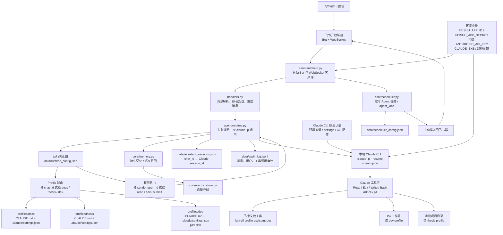
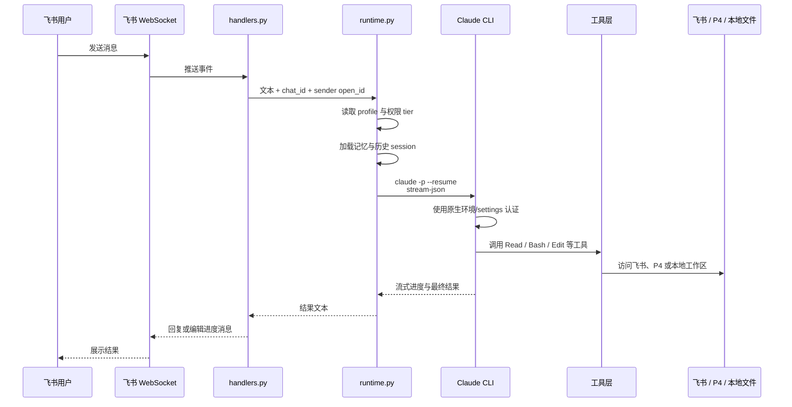
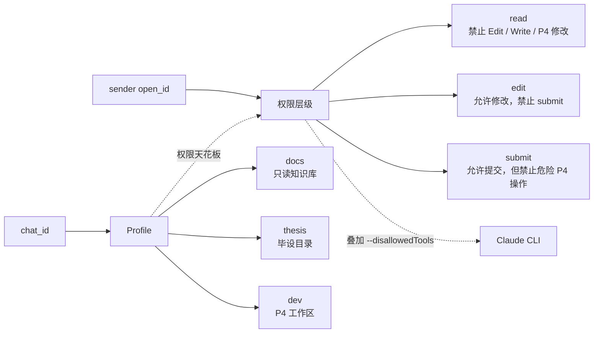
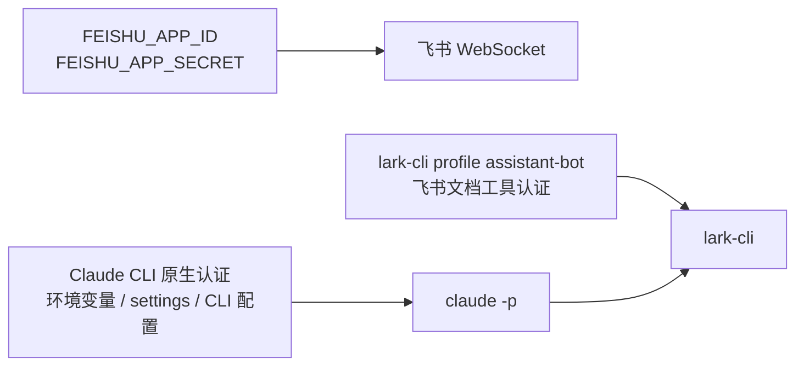

# 飞书团队 Agent 当前架构图

## 1. 总体架构

## 2. 普通消息处理时序

## 3. Profile 与权限隔离

## 4. 认证链路

## 5. 关键说明

- 飞书入口使用 WebSocket，不是业务层主动轮询。
- 每条飞书消息都会调用一次本机 Claude CLI，并通过 `--resume` 续接群聊会话。
- `chat_id` 决定 profile，`sender open_id` 决定权限层级。
- Claude API Key 不由项目代码注入；Claude CLI 使用自己的原生认证顺序。
- 飞书 App 凭证和 Claude 凭证是两套独立配置。
- `data/` 保存会话、记忆、调度配置和审计日志。
